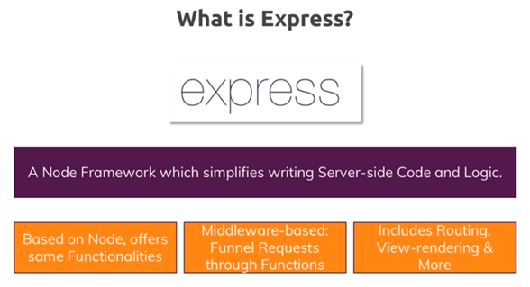

[TOC]


---


C:\Users\phuong\AppData\Local\Programs\Python\Python37\python.exe F:/programing/language/python/python-docs/readfile.py
======== name dir ========
## 1. Introduction
### 1. Welcome To The Course

MEAN là Mongodb, express, angular, node js

  

   

  


Single page application: no reload page, only remove and add new some element

Angular tutorial

https://www.javatpoint.com/angularjs-tutorial 

https://www.tutorialspoint.com/angular6/index.htm

Install nodejs 10+

Install angular cli

### 2. A Look At The Course Project


### 3. Environment & Setup

gitbook

### 4. Link To Project Files.html

You can find the course project repository at the link below...

https://github.com/bradtraversy/devconnector_2.0

## 2. Express & MongoDB Setup
### 1. MongoDB Atlas Setup

tranduyphuong18100@gmail.com

duyphuong1020

Create new project

  

Sau đó choose build a cluster

  

  

Đổi tên cluster 0 thành DevConnector rồi ấn create cluster

Result

  

Ấn vào connect

  

  

Chọn connect your application

```shell
mongodb+srv://Abc12345:<password>@devconnector-iiww1.mongodb.net/test?retryWrites=true&w=majority

```

  

Back và ấn collection 

  


### 2. Install Dependencies & Basic Express Setup
### 3. Connecting To MongoDB With Mongoose
### 4. Route Files With Express Router
## 3. User API Routes & JWT Authentication
### 1. Creating The User Model
### 2. Request & Body Validation
### 3. User Registration
### 4. Implementing JWT
### 5. Custom Auth Middleware & JWT Verify
### 6. User Authentication  Login Route
## 4. Profile API Routes
### 1. Creating The Profile Model
### 2. Get Current User Profile
### 3. Create & Update Profile Routes
### 4. Get All Profiles & Profile By User ID
### 5. Delete Profile & User
### 6. Add Profile Experience
### 7. Delete Profile Experience
### 8. Add & Delete Profile Education
### 9. Get Github Repos For Profile
## 5. Post API Routes
### 1. Creating The Post Model
### 2. Add Post Route
### 3. Get & Delete Post Routes
### 4. Post Like & Unlike Routes
### 5. Add & Remove Comment Routes
## 6. Getting Started With React & The Frontend
### 1. A Look At The The UI  Theme
### 2. Link To Theme Building Series On YouTube.html
### 3. React & Concurrently Setup
### 4. Clean Up & Initial Components
### 5. React Router Setup
### 6. Register Form & useState Hook
### 7. Request Example & Login Form
## 7. Redux Setup & Alerts
### 1. The Gist Of Redux
### 2. Creating a Redux Store
### 3. Alert Reducer, Action & Types
### 4. Alert Component & Action Call
## 8. React User Authentication
### 1. Auth Reducer & Register Action
### 2. Load User & Set Auth Token
### 3. User Login
### 4. Logout & Navbar Links
## 9. Dashboard & Profile Management
### 1. Protected Route For Dashboard
### 2. Profile Reducer & Get Current Profile
### 3. Starting On The Dashboard
### 4. CreateProfile Component
### 5. Create Profile Action
### 6. Edit Profile
### 7. Add Education & Experiences
### 8. List Education & Experiences
### 9. Delete Education, Experiences & Account


## 10. Profile DIsplay

### 1. Finish Profile Actions & Reducer

### 2. Display Profiles

### 3. Addressing The Console Warnings

### 4. Starting On The Profile

### 5. ProfileTop & ProfileAbout Components

### 6. Profile Experience & Education Display

### 7. Displaying Github Repos

## 11. Posts & Comments

### 1. Post Reducer, Action & Initial Component

### 2. Post Item Component

### 3. Like & Unlike Functionality

### 4. Deleting Posts

### 5. Adding Posts

### 6. Single Post Display

### 7. Adding Comments

### 8. Comment Display & Delete

## 12. Prepare & Deploy

### 1. Install Heroku CLI

### 2. Prepare For Deployment

### 3. Deploy To Heroku

## 13. Issues, Added Features, etc

### 1. About This Section.html

### 2. Not Found Page & Theme Workaround

======== list file ========

Process finished with exit code 0